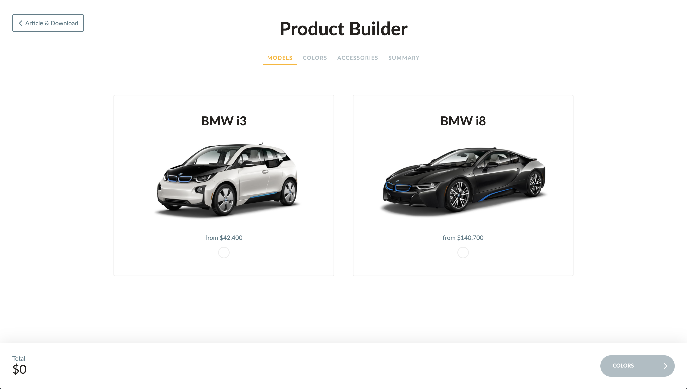

# Frontend Assessment

This assessment is designed to evaluate the technical and organizational skills of a candidate

## Preview

## The exercise

Create a clone of [this](https://codyhouse.co/demo/product-builder/index.html) project as close as you are capable of.

### FAQ

Q: Should I use a specific technology or framework?
A: No, the technology choices are completely open

Q: Do I need to build an API?
A: No, everything client-side is enough

Q: The design should be responsive?
A: Yes

### Bonus point (optional)

- Use TypeScript
- end-to-end test using [Cypress](https://www.cypress.io/) or equivalent tool

## Why this test

This design is simple yet has some challenging logic, making in interesting but not something that required a lot of time to complete.

### What is being tested

- reuse of components and logic
- capacity to reverse engineer a live application, this is a valuable skill when dealing with legacy code
- usage and knowledge of tooling and configuration
- form and wizard logic
- attention to details and quality when working and making tech choices autonomously
- use of global shared state across multiple UI elements
- care of details in copying a design
- small animations

## Time requirements

This assessment is meant to test how a candidate works in a work-like day-to-day situation, a tight deadline (days) is highly discouraged.
